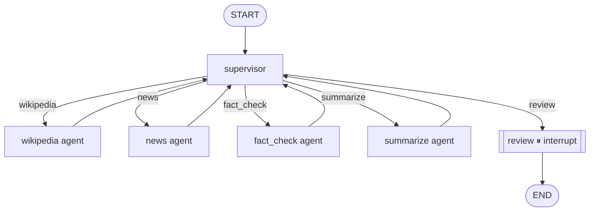

# Research Brief API (langgraph-multi-agent)

A **supervisor-based multi-agent system** that turns a one-word topic into a short research brief. A coordinator agent delegates to four specialists — Wikipedia, News, Fact-Checker, Summarizer — and pauses for human approval before publishing.

Everything runs locally. No cloud services, no API keys.

## Why this exists

Most "AI agent" demos are a single LLM call wrapped in a for-loop. This repo demonstrates the **supervisor pattern** — the canonical multi-agent topology where one coordinator decides who runs next and every specialist reports back to it. It also shows the pieces that make multi-agent systems **operable**:

* **Real external data** (Wikipedia REST API, Google News RSS) — no mocks in the demo path.
* **Graceful degradation** — a failed specialist doesn't kill the run.
* **Async job pattern** — submit, poll, fetch. No HTTP connection held open for 30 seconds.
* **Human-in-the-loop** — the run pauses for approval via LangGraph's `interrupt()` before the brief is finalized.

## Architecture



See `docs/architecture.md` for the full state schema and trace fields.

## Quick Start

1. **Start the stack:**

   ```bash
   docker-compose up --build
   ```

2. **Pull the model** (one-time, ~400 MB):

   ```bash
   docker-compose exec ollama ollama pull qwen2.5:0.5b
   ```

3. **Health check:** `http://localhost:8000/health`

4. **OpenAPI docs:** `http://localhost:8000/docs`

## Service Contract

### `POST /research/brief` → `202 Accepted`

Submit a new job. Returns immediately with a `run_id`.

```bash
curl -X POST http://localhost:8000/research/brief \
  -H "Content-Type: application/json" \
  -d '{"topic": "Tesla"}'
```

**Response:**

```json
{
  "run_id": "e2f8c3b1-...",
  "status": "pending",
  "message": "Job accepted. Poll /research/brief/{run_id}/status."
}
```

### `GET /research/brief/{run_id}/status`

Poll the lifecycle. Status values:

`pending` → `running` → `awaiting_review` → `completed`

(or `failed`).

```json
{
  "run_id": "e2f8c3b1-...",
  "topic": "Tesla",
  "status": "awaiting_review",
  "error": null,
  "created_at": "2026-09-20T10:00:00+00:00",
  "updated_at": "2026-09-20T10:00:22+00:00"
}
```

### `GET /research/brief/{run_id}`

Fetch the full state once the run has settled. Returns `202` while still running.

**Response (awaiting_review):**

```json
{
  "run_id": "e2f8c3b1-...",
  "status": "awaiting_review",
  "state": {
    "topic": "Tesla",
    "wikipedia_summary": "Tesla, Inc. is an American multinational automotive...",
    "wikipedia_url": "https://en.wikipedia.org/wiki/Tesla,_Inc.",
    "news_headlines": [
      {
        "title": "...",
        "link": "...",
        "published": "..."
      }
    ],
    "fact_check_notes": [
      {
        "claim": "...",
        "verdict": "SUPPORT"
      }
    ],
    "draft_brief": "Tesla is an American electric vehicle...",
    "errors": [],
    "trace": [
      {
        "node": "supervisor",
        "next": "wikipedia",
        "completed": []
      },
      {
        "node": "wikipedia",
        "status": "ok",
        "chars": 842
      },
      {
        "node": "supervisor",
        "next": "news",
        "completed": [
          "wikipedia"
        ]
      },
      "...",
      {
        "node": "summarize",
        "status": "ok",
        "chars": 612
      },
      {
        "node": "supervisor",
        "next": "review",
        "completed": [
          "wikipedia",
          "news",
          "fact_check",
          "summarize"
        ]
      }
    ]
  },
  "interrupt": {
    "reason": "final_approval",
    "topic": "Tesla",
    "draft_brief": "Tesla is an American electric vehicle...",
    "instructions": "Reply with {'action': 'approve'} to publish..."
  }
}
```

### `POST /research/brief/{run_id}/resume`

Deliver a human decision to a paused run.

```bash
curl -X POST http://localhost:8000/research/brief/{run_id}/resume \
  -H "Content-Type: application/json" \
  -d '{"action": "approve", "note": "Looks good."}'
```

| `action`  | Effect                                   |
| --------- | ---------------------------------------- |
| `approve` | Sets `final_brief = draft_brief`         |
| `reject`  | Discards the draft; `final_brief = null` |

Returns `400` if the run isn't currently in `awaiting_review`.

### `GET /health`

Returns:

```json
{
  "status": "ok",
  "llm_reachable": true
}
```

## Running Tests

```bash
docker-compose exec api python -m pytest tests/ -v
```

The suite runs with `TESTING=1`, which swaps every agent for canned data.

Tests exercise the **graph topology, job lifecycle, and API contract** — not the network or the LLM. Fast, deterministic, CI-ready.

For a real end-to-end run (hits Wikipedia, Google News, and Ollama), use the `curl` examples above.

## Feature Checklist

* ✅ Supervisor pattern with four distinct specialist agents
* ✅ Human-in-the-loop `interrupt()` before finalizing
* ✅ Shared/typed `TypedDict` state visible to every agent
* ✅ Graceful degradation — agent failures don't crash the run
* ✅ Async job pattern (`202 Accepted` + status polling)
* ✅ SQLite checkpointer — runs survive API restarts
* ✅ Real data sources: Wikipedia REST API, Google News RSS (no keys)
* ✅ Full pytest integration suite
* ✅ Graph diagram in README and `docs/architecture.md`

## Project Structure

```text
langgraph-multi-agent/
├── app/
│   ├── main.py                   # FastAPI + lifespan
│   ├── core/
│   │   ├── config.py             # Settings
│   │   └── llm.py                # Ollama LLM client
│   ├── graph/
│   │   ├── state.py              # TypedDict shared state
│   │   ├── supervisor.py         # Coordinator node
│   │   ├── agents.py             # 5 node functions (4 agents + review)
│   │   ├── workflow.py           # Graph topology
│   │   └── runtime.py            # Graph + checkpointer + jobs conn
│   ├── jobs/
│   │   ├── registry.py           # Jobs table (SQLite)
│   │   └── runner.py             # Background task spawner
│   ├── routers/
│   │   ├── health.py
│   │   └── brief.py              # POST/GET/resume endpoints
│   └── schemas/
│       └── brief.py              # Pydantic request/response
├── tests/
│   ├── conftest.py
│   └── test_brief.py
├── docs/
│   └── architecture.md           # Mermaid diagram + state schema
├── docker-compose.yml
├── Dockerfile
└── requirements.txt
```

## Design Decisions

* **Deterministic supervisor, not LLM-driven.** With a 0.5B local model, an LLM-based coordinator is slow and unreliable. The supervisor is a rules table over `AGENT_ORDER`. The interface is identical — swapping in an LLM-driven version means replacing one function body.
* **Every specialist routes back to the supervisor.** This is what makes it a supervisor pattern rather than a DAG. New agents slot in with two lines (`add_node` + `add_edge` back to supervisor) and one entry in `AGENT_ORDER`.
* **Errors go into state, not up the stack.** A failed Wikipedia call doesn't stop the news agent from running; the trace records exactly where it failed.
* **Jobs table is separate from graph checkpoints.** The checkpointer stores what the graph computed; the jobs table stores whether the run is alive. Different concerns, different tables.
* **`asyncio.create_task` needs a strong reference.** Background tasks are kept in a module-level set to prevent GC from collecting them mid-run.
* **`TESTING=1` swaps in canned agents.** Production code has a small testing branch; the alternative (monkeypatching LangGraph nodes) is fragile.

## What I'd Do With More Time

* **LLM-driven supervisor** — replace the deterministic rules table with a prompt that reads a summary of state and picks the next action. The graph shape doesn't change.
* **Reranking on news** — filter Google News results for relevance before feeding them to the fact-checker.
* **Streaming status updates** — convert `GET /status` to SSE so clients see each node transition as it happens instead of polling.
* **Postgres checkpointer** — swap SQLite for Postgres to support concurrent operators and multi-process deployments.
* **Real worker queue** — replace `asyncio.create_task` with arq or Celery so background jobs survive a server restart.
* **Multiple brief formats** — executive summary, technical deep-dive, and bullet-point TL;DR generated in parallel, then a synthesis pass.
