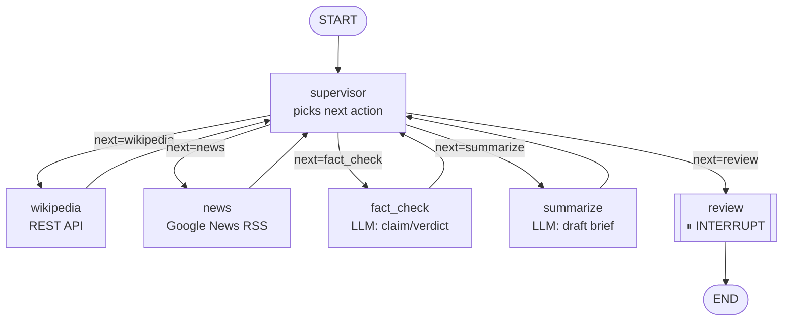

# Multi-Agent Supervisor Architecture



## The supervisor pattern

- **One coordinator** (`supervisor`) has outgoing conditional edges.
- **Every specialist** has exactly one outgoing edge: back to the supervisor.
- The supervisor walks `AGENT_ORDER = ["wikipedia", "news", "fact_check", "summarize"]` and dispatches to whichever specialist hasn't yet been marked completed in the shared state.
- When all four are done, the supervisor routes to `review`, which calls `interrupt()` to pause the graph.

## Shared state (`BriefState`)

| Field | Set by | Purpose |
|-------|--------|---------|
| `topic` | caller | Input |
| `completed` | every agent | Supervisor's bookkeeping |
| `next_action` | supervisor | Routing target |
| `wikipedia_summary` / `wikipedia_url` | wikipedia | Raw material |
| `news_headlines` | news | Raw material |
| `fact_check_notes` | fact_check | Claim/verdict pairs |
| `draft_brief` | summarize | Awaiting approval |
| `final_brief` | review | Populated on approve |
| `human_action` / `human_note` | review | Audit trail |
| `errors` | any agent | Graceful degradation |
| `trace` | every node | Observability |

## Graceful degradation

Every agent wraps its work in `try/except` and pushes failures into `errors` instead of raising. A broken Wikipedia call doesn't stop the news fetch, the fact-check just skips, and the brief still reaches human review. The trace shows exactly where the failure happened.

## Persistence

- **Graph state** → `AsyncSqliteSaver`, keyed by `thread_id` (= API `run_id`).
- **Job lifecycle** → a separate `jobs` table in the same SQLite file.
- Both connections live in `app/graph/runtime.py`, opened once at startup.

## Regenerate the diagram

```python
from app.graph.workflow import build_graph
print(build_graph().compile().get_graph().draw_mermaid())
```